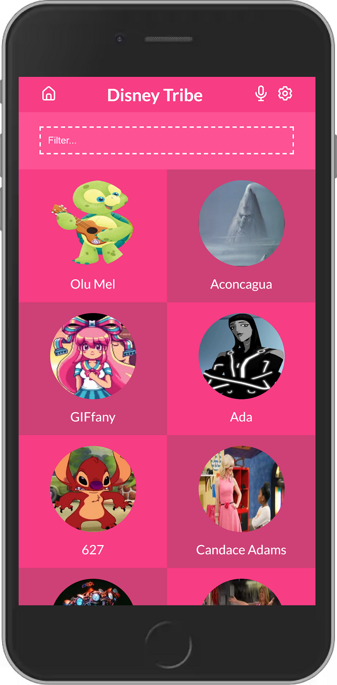

# React Capstone Project: Disney Tribe

> Disney Tribe is built using React, Redux, DisneyAPI, and iconscout icons.
> It displays list of Disney characters and on click of any character it will show more information about the same character.

## Snapshoot for the project : 


## Built With

- **HTML**
- **CSS**
- **JavaScript**
- **Gitflow**
- **React**
- **Redux**
- **DisneyAPI**

## Video Presentation

[Click on the link to see the presentation](https://drive.google.com/file/d/1kIy0Z1Xg9J531IF44gczaPHVIkliOEuA/view?usp=sharing)

## Get Live Demo
[Live Demo](https://disney-tribe.netlify.app/)

## Getting Started

### Steps to run the project

#### 1 - Git Clone.

```
git clone https://github.com/AlaaShaheen2/capstone-react.git
```
#### 2 - Install node packages.

```
npm install
```

#### 3 - run the project

```
npm start
```

## Available Scripts

In the project directory, you can run:

### `npm start`

Runs the app in the development mode.

### `npm test`

Launches the test runner in the interactive watch mode.

### `npm run build`

Builds the app for production to the `build` folder.

### `npm run eject`

**Note: this is a one-way operation. Once you `eject`, you can't go back!**

If you aren't satisfied with the build tool and configuration choices, you can `eject` at any time. This command will remove the single build dependency from your project.

## Author
👤 **Alaa Shaheen**

- GitHub: [@AlaaShaheen2](https://github.com/AlaaShaheen2)
- Twitter: [@Alaa Shaheen](https://twitter.com/AlaaShaheen93)
- LinkedIn: [@Alaa Shaheen](https://www.linkedin.com/in/alaa-shaheen-879140240/)


## Acknowledgments

> Thanks to all the developers whose code was used.

## 🤝 Contributing

Contributions, issues, and feature requests are welcome!

Feel free to check the [issues page](../../issues/).

## Show your support

Please give a ⭐️ if you like this project!

## 📝 License
- This project is [MIT](./LICENSE.txt) licensed.